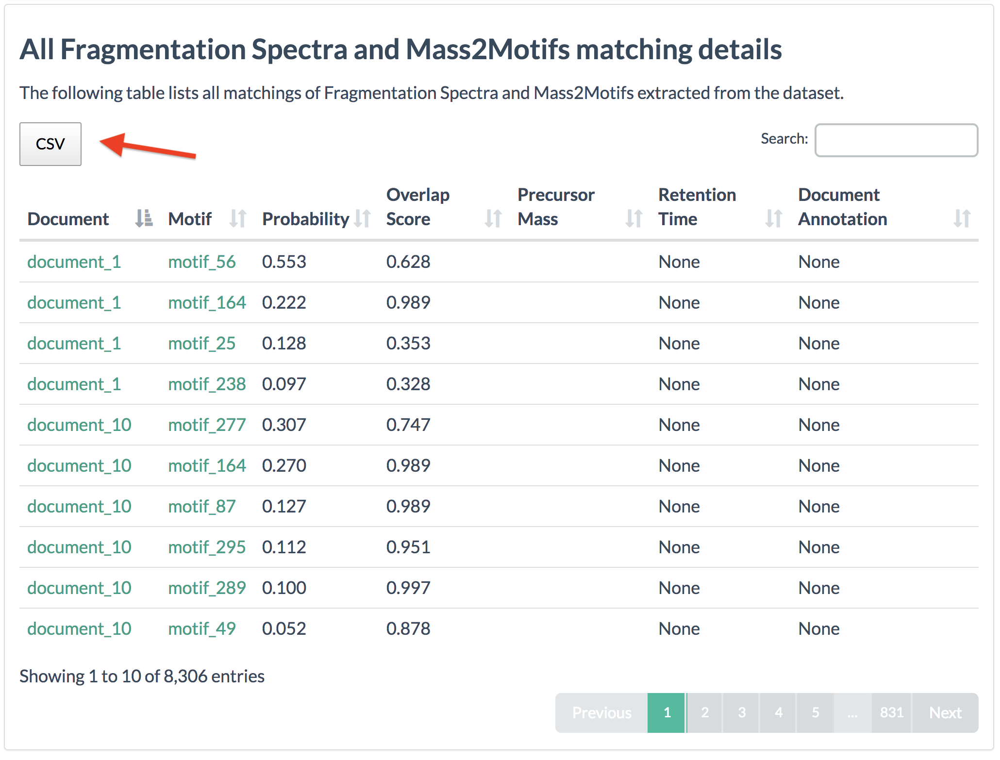

# A simple python script to map MS2LDA to GNPS molecular networks

## 1. Run the feature based molecular networking workflow
See the documentation here
[https://ccms-ucsd.github.io/GNPSDocumentation/featurebasedmolecularnetworking/]()

Citation: Wang et al. *Nature Biotechnology*, 34, 828–837 (2016) [https://www.nature.com/articles/nbt.3597]()

## 2. Run MS2LDA
**See the documentation here:**
[http://ms2lda.org/user_guide/](http://ms2lda.org/user_guide/)

**Citations:**
van der Hooft et al. *Anal. Chem.*, 2017, 89 (14), pp 7569–7577, [https://pubs.acs.org/doi/abs/10.1021/acs.analchem.7b01391]()

Wandy et al. *Bioinformatics*, 34, 2, 2018, 317–318, [https://pubs.acs.org/doi/abs/10.1021/acs.analchem.7b01391]()

## 3. Download the MS2LDA CSV table
Download the table MS2LDA CSV table from ([http://ms2lda.org]()) 
The table is named "All Fragmentation Spectra and Mass2Motifs matching details".

## 4. Convert the MS2LDA with the python script
**Run the script as follow:**

`python MS2LDA_to_GNPS_molecularnetworks.py inputfilename.csv`

**Requirements**:
- Python 3.7 and the following libraries available: *sys, os, argparse, csv, pandas, math*

## 5. Import the new table into Cytoscape
Import the output table ouputted by the script in Cytoscape. 

**Important:** The molecular networks have be to generated from the same .MGF file as the one used for the feature based molecular networking job.
[https://ccms-ucsd.github.io/GNPSDocumentation/featurebasedmolecularnetworking/]()

Authors: 
Zheng Zhang with Louis Felix Nothias, University of California San Diego
